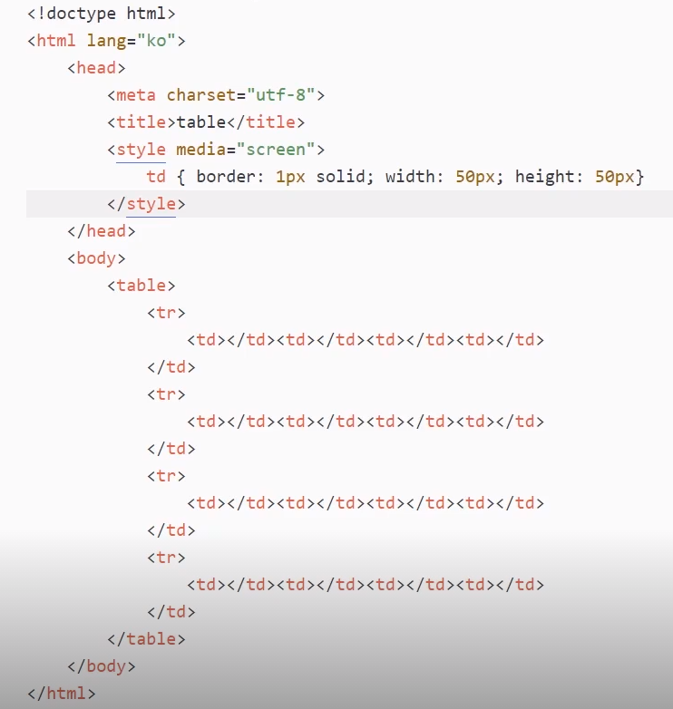

현재 130개 정도 존재한다.

html, head,body, title → 기본 외에는 사용 빈도가 그렇게 많지는 않다
<br>
### 1) 제목과 단락 요소

**Keyword**

- Heading Tag (h1~h6)
- Paragraph Tag (p)
- Linebreak Tag (br)
<br>
1. **제목 태그 (Heading Tag)**

    숫자 올라갈 수록 더 낮은 수준의 소제목을 나타낸다

    요즘에는 이미지나 그림처럼 시각적 형태로 표현되고 있어서 제목 태그를 <h6> 까지 쓰는 경우는 거의 없다

    ```html
    <h1>역사</h1>
    <h2>개발</h2>
    1980년, 유럽 입자 물리 연구소(CERN)의 계약자였었던 물리학자 팀 버너스리가 HTML의 원형인 인콰이어를 제안하였다.
    ... 이하 생략
    <h2>최초 규격</h2>
    HTML 최초의 일반 공개 설명은 1991년 말에 버너스리가 처음으로 인터넷에서 문서를 "HTML 태그"(HTML tag)로 부르면서 시작되었다.
    ... 이하 생략
    ```

    제목 태그는 일반적 글보다 더 크고 굵게 자동적으로 적용된다
<br>
2. **단락 태그 (Paragraph Tag)**

    화면에는 별다른 변화는 없지만, 이전보다 훨씬 의미에 맞게 잘 짜인 마크업 구조라고 볼 수 있습니다.

    ```html
    <h1>역사</h1>
    <h2>개발</h2>
    <p>
        1980년, 유럽 입자 물리 연구소(CERN)의 계약자였었던 물리학자 팀 버너스리가 HTML의 원형인 인콰이어를 제안하였다.
        ... 이하 생략
    </p>
    <h2>최초 규격</h2>
    <p>
        HTML 최초의 일반 공개 설명은 1991년 말에 버너스리가 처음으로 인터넷에서 문서를 "HTML 태그"(HTML tag)로 부르면서 시작되었다.
        ... 이하 생략
    </p>
    ```

    **3. 개행**

    <p>를 사용하면 자연스럽게 개행이 된다

    <p> 내부 임의로 개행하려면, <br>을 사용한다. (breakline)

    개행하고자 하는 곳에 <br>을 선언하면 개행이 된다
<br>
### 2) 텍스트를 꾸며주는 요소

<b> <i> <u> <s>

 ****

**텍스트 표현 태그**

웹 표준화로 인해, 웹 문서의 구조와 표현이 분리 되었다. 따라서 지금은 얼마 남지 않았다

- <b> : bold 태그는 글자를 굵게 표현하는 태그
- <i> : italic 태그는 글자를 기울여서 표현하는 태그
- <u> : underline 태그는 글자의 밑줄을 표현하는 태그
- <s> : strike 태그는 글자의 중간선을 표현하는 태그 (예전에 존재했던 strike 태그와는 다른 태그로, strike 태그는 폐기되어 더는 사용할 수 없습니다.)

HTML 5 에서 <i> 태그가 인용문을 사용하는 태그로 변경되었다

추가로 찾아보려면 line text semantics를 찾아볼 것을 권장한다


<br>
### 3) 앵커 요소

HT (Hyper Text) → 링크

앵커 태그를 통해 생성을 한다

다른 페이지로 이동하거나, 현재 페이지에서 특정 위치로 이동할 수 있다

```html
<a href="http://www.naver.com/" target="_blank">네이버</a>
```
<br>
**href 속성**

링크 만들기 위해 <a>는 반드시 href 속성을 갖고 있어야 한다 (**목적지 URL**)
<br>
**target 속성**

링크된 리소스를 어디에 표시할지 나타낸다

속성값으로 _self, _blank, _parent, _top이 있다

**_self**: 현재 화면에 표시 → 선언되지 않으면 기본적으로 self처럼 작동

**_blank**: 새로운 창에 표시 → 외부 페이지가 나타나게끔 한다

**_parent,** **_top**: 특정 조건에서만 동작 → 최근에는 프레임을 잘 쓰지 않음

[https://developer.mozilla.org/en-US/docs/Web/HTML/Element/a](https://developer.mozilla.org/en-US/docs/Web/HTML/Element/a)

 여기서 나머지 속성들을 참고하자
<br>
**내부 링크**

`<a>`를 통해 만들어진 링크가 꼭 외부 페이지로만 이동하는 것은 아니다

페이지 내 특정 요소 초점으로 이동할 수 있는데, 이를 내부 링크라고 한다

내부 링크 사용 시 href 속성에 #를 쓰고, 그 뒤에 페이지 내에서 이동하고자 하는

요소의 id 속성을 적으면 된다

페이지가 길어질 시 맨 위로 이동하기 등이 그 예시다.
<br>
```html
<a href="#some-element-id">회사 소개로 이동하기</a>

... 중략.

<h1 id="some-element-id">회사 소개</h1>
```


텍스트에 하이퍼링크 걸기


<br>
### 4) 의미가 없는 컨테이너 요소

- div, span

이제는 시각적 정보를 표현하는 방향으로 발전

이를 대응하기 위해 새로운 태그들이 생기기도 하는데

새로운 콘텐츠 표현을 표현하기 적합한 태그 없을 시 의미 없는 태그들 사용

문서 스타일이나 데이터 전송 등 부가적인 기능을 휘해서도 사용

**의미가 없는 컨테이너 요소**

단순 요소 묶기를 위해 사용되는 태그

스타일을 주거나 서버에 보내는 **데이터 담기 위한 용도**로 의미 없는 요소들이 사용된다

지금은 자주 사용된다 → 현재는 문서 형태를 많이 벗어나서 사용된다

```html
<div>
	<span>Lorem</span> ipsum dolor sit.
</div>
```

<div> → block-level

<span> → inline-level

사용한다고 해서 영향이 없다


<br>
### 5) 리스트 요소

- ul
- ol
- dl

**`<ul>`**

순서 없는 리스트 (unordered list)

```html
<ul>
	<li>콩나물</li>
	<li>파</li>
	<li>국 간장</li>
	...
</ul>
```

<li>는 각 항목을 나타내는데 사용한다

**`<ol>`**

순서가 있는 리스트를 표현할 때 사용한다

```html
<ol>
    <li>냄비에 국물용 멸치를 넣고 한소끔 끓여 멸치 육수를 7컵(1,400ml) 만든다.</li>
    <li>콩나물을 넣고 뚜껑을 덮어 콩나물이 익을 때까지 끓인다.</li>
    <li>뚜껑을 열고 대파, 마늘, 고춧가루를 넣고 끓인다.</li>
    ...
</ol>
```

**`<dl>`**

dl (definition/description) 용어와 정의를 표현할 때 사용한다

이는 앞선 ul, ol 같은 단순 나열이 아닌, 용어와 설명이 하나의 세트로 항목을 이루는

하나 이상의 항목으로 리스트가 이루어진 구조

```html
<dl>
    <dt>리플리 증후군</dt>
    <dd>허구의 세계를 진실이라 믿고 거짓된 말과 행동을 상습적으로 반복하는 반사회적 성격장애를 뜻하는 용어</dd>
    <dt>피그말리온 효과</dt>
    <dd>타인의 기대나 관심으로 인하여 능률이 오르거나 결과가 좋아지는 현상</dd>
    <dt>언더독 효과</dt>
    <dd>사람들이 약자라고 믿는 주체를 응원하게 되는 현상</dd>
</dl>
```

- <dt> : 용어를 나타내는 태그
- <dd> : 용어에 대한 정의 또는 설명을 나타내는 태그

용어 하나에 여러 정의가 들어갈 때, <dd>를 한 개 이상 쓰는 것이 가능합니다.

<br>
**리스트의 중첩**


ol 태그 안에는 div나 p 등 자식 요소가 못 들어오지만, li 안에는 가능하다

들여쓰기는 실수 방지용이다

<br>
### 6) 이미지 요소

- img
- alt
- src

**``**

이미지를 삽입하는 빈 태그이다

```html

```

**src 속성**

이미지의 경로를 나타내는 필수 속성

**alt 속성**

이미지 대체 텍스트를 나타내는 필수적 특성

**width/height 속성**

이미지 가로 세로 크기 설정. 픽셀로 나타낸다. 고정적이면 설정해주는 것이 성능이 좋다

없을 시는 원본 크기대로 노출, 하나만 선언하면 자동적으로 비율에 맞게 나타냄

**상대경로와 절대경로**

상대경로: 현재 웹 기준 이미지 위치

절대경로: 전체 경로

```html
<!-- 상대경로 -->


<!-- 절대경로 -->


```

**이미지 파일 형식**

- gif : 제한적인 색을 사용하고 용량이 적으며 투명 이미지와 애니메이션 이미지를 지원하는 형식
- jpg : 사진이나 일반적인 그림에 쓰이며 높은 압축률과 자연스러운 색상 표현을 지원하는 형식(투명을 지원하지 않는다.)
- png : 이미지 손실이 적으며 투명과 반투명을 모두 지원하는 형식


우측은 회색 임시 박스가 나온다


투명이미지는 뒷 배경이 투영된다
<br>
### 7) 테이블 요소 - 1

- table
- th
- tr
- td
<br>
**표의 구성요소**

표는 셀로 이루어지고, 행(row), 열(column) 이란 단위로 표현한다

- <table> : 표를 나타내는 태그
- <tr> : 행을 나타내는 태그
- <th> : 제목 셀을 나타내는 태그
- <td> : 셀을 나타내는 태그

```html
<table>
    <tr>
        <td>1</td>
        <td>2</td>
        <td>3</td>
        <td>4</td>
    </tr>
    <tr>
        <td>5</td>
        <td>6</td>
        <td>7</td>
        <td>8</td>
    </tr>
    <tr>
        <td>9</td>
        <td>10</td>
        <td>11</td>
        <td>12</td>
    </tr>
    <tr>
        <td>13</td>
        <td>14</td>
        <td>15</td>
        <td>16</td>
    </tr>
</table>
```

단순 HTML은 테두리가 없어서 어색한데, CSS 코드를 입혀서 추가해준다

```html
<style>
    th, td { border: 1px solid; }
</style>
```
<br>
**표의 구조와 관련된 태그**

표를 구조적으로 파악하기 위한 태그

- <caption>: 표의 제목을 나타내는 태그
- <thead>: 제목 행을 그룹화하는 태그
- <tfoot>: 바닥 행을 그룹화하는 태그
- <tbody>: 본문 행을 그룹화하는 태그

```html
<table>
    <caption>Monthly Savings</caption>
    <thead>
        <tr>
            <th>Month</th>
            <th>Savings</th>
        </tr>
    </thead>
    <tbody>
        <tr>
            <td>January</td>
            <td>$100</td>
        </tr>
        <tr>
            <td>February</td>
            <td>$80</td>
        </tr>
    </tbody>
    <tfoot>
        <tr>
            <td>Sum</td>
            <td>$180</td>
        </tr>
    </tfoot>
</table>
```

<tfoot>은 <tbody> 다음에 온다.




<br>
```html
<!doctype html>
<html lang="ko">
  <head>
    <meta charset="utf-8">
    <title>table</title>
    <style media="screen">
      td { border: 1px solid; width: 50px; height: 50px}
    </style>
  </head>
  <body>
    <table>
      <caption>Monthly Savings</caption>
      <thread>
        <tr>
          <th>Month</th>
          <th>Savings</th>
        </tr>
      </thread>
      <tbody>
        <tr>
          <td>January</td>
          <td>$100</td>
        </tr>
        <tr>
          <td>Febuary</td>
          <td>$80</td>
        </tr>
        <tr>
          <td>March</td>
          <td>$60</td>
        </tr>
      </tbody>
      <tfoot>
        <tr>
          <td>Sum</td>
          <td>$240</td>
        </tr>
      </tfoot>
    </table>
  </body>
</html>
```

제목행에는 <td> 대신 <th>를 사용한다


```html
...
<tfoot>
	<tr><td colspan="2">Sum</td></tr>
</tfoot>
	<tbody>
		<tr><td>January</td> <td>$100</td>
		<tr><td>Febuary</td> <td rowspan="2">$80</td></tr>
		<tr><td>March</td></tr>
	</tbody>
```
<br>
- colspan: 셀을 가로방향으로 병합
- rowspan: 셀을 세로 방향으로 병합

colspan이 들어가면 속성 값만큼 셀을 갖는다. 태그 수가 하나로 병합된 것이다
<br>
### 8) 테이블 요소 2

**좀더 복잡한 표 만들기**

- <colgroup>
- <col>
- scope 속성
- header 속성

은 강의에서는 안 다뤘지만, 자주 나오므로 공부하라
<br>
```html
<!DOCTYPE html>
<html lang="ko">
  <head>
    <meta charset="utf-8">
    <style media="screen">
      th, td { border: 1px solid; width: 50px; height: 50px}
      table { border-collapse: collapse; text-align: center;}
    </style>
  </head>
  <body>
    <table>
      <caption>Specification values</caption>
      <thread>
        <tr>
          <th rowspan="2">Grade.</th>
          <th rowspan="2">Point.</th>
          <th colspan="2">Strength.</th>
          <th rowspan="2">Percent.</th>
        </tr>
        <tr>
          <th>kg/mm</th>
          <th>lb/in</th>
        </tr>
      </thread>
      <tbody>
        <tr>
          <td>Hard</td>
          <td>0.45</td>
          <td>56.2</td>
          <td>80,000</td>
          <td>20</td>
        </tr>
        <tr>
          <td>Medium</td>
          <td>0.45</td>
          <td>49.2</td>
          <td>70,000</td>
          <td>25</td>
        </tr>
        <tr>
          <td>Soft</td>
          <td>0.45</td>
          <td>42.2</td>
          <td>60,000</td>
          <td>30</td>
        </tr>
      </tbody>
    </table>
  </body>
</html>
```


나온 결과물이다

코드를 잘 뜯어서 봐라
<br>
**+1) `<colgroup>`**

표의 열을 묶는 그룹을 정의한다. 같은 색상 그룹


<br>
**+2)`<col>`**

col group 안에서 열에 속하는 칸에 공통된 의미를 부여할 때 사용한다
<br>
**+3)** **scope 속성**

```html
...
<thead>
	<tr>
		<th scope="col">면적</th>
		<th scope="col">매매가</th>
		<th scope="col">전세가</th>
	</tr>
	<tr>
		<th scope="row">159B</th>
		<th scope="row">195</th>
	</tr>
```


스크린 리더기에서 읽어주는 것이 필요해서 이렇게 프로그래밍한다


colgroup와 rowgroup을 통해 표현해준다. (여기서는 colgroup만 사용)

```html
<table width="100%" summary="월별 스마트폰, 테블릿PC, Desktop 판매현황">
	<caption>상품에 따른 월별 판매현황</caption>
	<colgroup>
		<col width="20%" />
		<col width="25%" />
		<col width="25%" />
		<col width="30%" />
	</colgroup>
	<thead>
		<tr>
			<th rowspan="2" scope="col">구분</th>
			<th colspan="3" scope="colgroup">상품종류</th> <!-- 병합 되었을 때의 그룹 -->
		</tr>
		<tr>
			<th scope="col">스마트폰</th>
			<th scope="col">테블릿PC</th>
			<th scope="col">Desktop</th>
		</tr>
	</thead>
	<tbody>
		<tr>
			<th scope="row">1월</th>
			<td>5만대</th>
			<td>3민대</th>
			<td>1만대</th>
		</tr>
	</tbody>
</table>
```


<br>
**+4) header 태그**

예전에는 div로만 만들었다면, 요즘에는 header 태그를 이용해 상단 메뉴를 만든다. <footer>도 존재


```html
<!DOCTYPE html>
<html>
<head>
<meta charset="utf-8" />
<title>header 태그</title>
</head>
<body>
    <header>
        <div id="serviceNameArea">
            <div>
                
            </div>
            <a href="/">
                <h1 id="serviceName">everdevel</h1>
                <h2>Web Technology, 에버디벨</h2>
            </a>
        </div>
        <div id="searchArea">
            <div id="searchEngineKeywordLabel">
                <input type="text" id="searchEngineKeyword" placeholder="검색어를 입력하세요.">
            </div>
            <div id="searchBtnLabel">
                
            </div>
        </div>
    </header>
</body>
</html>
```


<br>
### 9) 폼 요소 1

사용자에게 텍스트나 데이터를 입력받는 것

- type = "text"

- placeholder

- type = "password"

- type = "radio"

- type = "checkbox"
<br>
서버에 데이터를 전달하기 위한 요소

대표적 폼 요소 <input>

빈 요소이며, 여러 type를 통해 여러 종류의 입력 양식이 나타난다
<bt>
1. **type="text"**

    ```html
    <input type="text" placeholder="ㅇㅇㅇ">

    아이디, 이름, 주소, 전화번호 등 단순 텍스트 입력 시 사용
    type="text" 에는 placeholder라는 속성이 존재하는데
    사용자가 입력 전 화면에 미리 노출되는 값으로, 양식을 표현할 때 사용한다
    ```
<br>
2. **type="password"**

    ```html
    <input type="password">

    공개할 수 없는 내용 입력할 때 사용
    ```
<br>
3. **type="radio"**

    ```html
    <input type="radio" name="gender"> 남자
    <input type="radio" name="gender"> 여자

    라디오 버튼. 중복 불가 - 하나만 선택해야한다
    ```
<br>
4. **type="checkbox**

    ```html
    <input type="checkbox" name="hobby"> 등산
    <input type="checkbox" name="hobby"> 독서
    <input type="checkbox" name="hobby"> 운동

    중복 선택 가능한 체크박스를 만들 수 있다
    ```
<br>
body 내에 입력을 한다

라디오 버튼과 체크박스에는 checked, name 속성이 존재한다.

checked 속성은 값이 별도로 존재하지 않는 boolean 속성. checked를 통해 이미 체크되도록 만들 수도 있다.

name 속성은 라디오 버튼과 체크박스를 그룹화시켜주는 속성


`<br>`을 통해 보기 좋게 강제개행
<br>
### 10) 폼 요소 2

다양한 input 요소들에 관하여 알아보자

- type = "file" : 파일을 서버에 올릴 때 사용
- type = "submit" : submit|reset|image|button
- type = "image"
- type = "button"

submit 버튼

```html
<form action="./test.html">
    메시지: <input type="text" name="message"><br>
    <input type="submit">
    <input type="reset"> # 리셋 요소도 있다
    <input type="image" src="http://placehold.it/50x50?text=click" alt="click" width="50" height="50">
    <input type="button" value="버튼">
</form>
```
<br>
리셋 타입은 페이지 초기 기본 값으로 변경된다

버튼 타입은 아무 기본 동작도 주어지지 않는다


<br>
1. type="file"

    ```html
    <input type="file">
    ```
<br>
2. type="submit|reset|image|button"

    ```html
    <form action="./test.html">
        메시지: <input type="text" name="message"><br>
        <input type="submit">
        <input type="reset">
        <input type="image" src="http://placehold.it/50x50?text=click" alt="click" width="50" height="50">
        <input type="button" value="버튼">
    </form>
    ```
<br>
- submit : form의 값을 전송하는 버튼
- reset : form의 값을 초기화하는 버튼
- image : 이미지를 삽입할 수 있는 버튼 (submit과 동작이 동일함)
- button : 아무 기능이 없는 버튼
<br>
### 11) 폼 요소 3
<br>
- <select> , <textarea>, <button>
1. **<select>**

    선택 목록 상자 (콤보박스)

    리스트 형태로 노출하고 하나를 선택할 수 있게 한다

    

    

    ```html
    사는 지역: <select> <!-- 앞에 글자 추가 가능하다-->
        <option>서울</option>
        <option>경기</option>
        <option>강원</option>
        ...
    </select>
    <!-- <option selected>제주</option> 처음 선택되는 칸을 설정 가능하다 -->
    ```
<br>
2. **<textarea>**

    여러 줄의 텍스트를 입력 받을 때 사용한는 태그

    빈 태그가 아니다. 속성으로 cols와 rows가 있다

    ```html
    <textarea rows="5" cols="30">
        ...
    </textarea><br>
    ```
<br>
3. **<button>**

    ```html
    <button type="submit|reset|button">ㅇㅇㅇ</button>
    ```

    

    

다음과 같이 같게 나온다

### 12) 폼 요소 4

- label
- fieldset
- legend
- form
<br>
**`<label>`**

폼 요소 이름과 요소 자체를 명시적으로 연결해 주기 위해 사용

모든 폼 요소에 사용할 수 있습니다

```html
<label for="name">이름</label>: <input type="text" id="name"><br>
<label for="nickname">이름</label>: <input type="text" id="nickname"><br>
<label for="address">이름</label>: <input type="text" id="address"><br>
```

**폼 요소의 id 속성값 == <label>의 for 속성값** (같게 적어줘야 한다)

<label> 사용 시, 이를 클릭했을 경우 해당 form 요소를 클릭한 것처럼 동작

스크린 리더기가 form 요서 접근 시, label을 함께 읽어준다
<br>
`**<fieldset>**`, **`<legend>`**

form 요소를 구조화 하기 위한 태그

- <fieldset> : 여러 개의 폼 요소를 **그룹화**하여 구조적으로 만들기 위해 사용
- <legend> : **폼 요소의 제목**으로 **<fieldset> 내부**에 작성

<legend>는 <fieldset>의 자식으로 반드시 최상단에 위치해야 한다
<br>
```html
<fieldset>
	<legend>기본 정보</legend>
	...폼 요소들...
</fieldset>
<fieldset>
	<legend>부가 정보</legend>
	...폼 요소들...
</fieldset>
```
<br>
**`<form>`**

요소들을 감싸는 태그로 데이터를 묶어서 실제 서버로 전송해준다

만일 <fieldset>으로 구조화 되어 있을 시, <fieldset도 함께 감싸는 역할을 한다

```html
<form action="" method="">
	<fieldset>
		<legend>기본정보</legend>
		...폼 요소들...
	</fieldset>
	<fieldset>
		<legend>부가 정보</legend>
		...폼 요소들...
	</fieldset>
</form>
```
<br>
**form의 대표적인 2가지 속성**

- action: 데이터를 **처리하기 위한 서버의 주소**
- method: 데이터를 **전송하는 방식을 지정**

method 속성값에는 get/post 2가지 방식 존재

get → 데이터 전송 시, 주소창에 파라미터 형태로 붙어 데이터가 노출된다

post → 데이터 전송 시 데이터가 노출되지 않는다
<br>
**코드 실습**

```html
<!DOCTYPE html>
<html lang="ko">
<head>
	<meta charset="UTF-8">
	<title>form</title>
</head>
<body>
	<form action="">
		<h1>Form 관련 요소</h1>
		<fieldset>
			<legend>기본 정보</legend>
			<label for="userid">아이디 : </label> <input type="text" placeholder="영문으로만 써주세요" id="userid"><br>
			<label for="userpw">비밀번호 : </label> <input type="password" id="userpw"><br>
			성별 : <label for="male">남자</label> <input type="radio" name="gender" id="male" checked>, <label for="female">여자</label> <input type="radio" name="gender" id="female"><br>
		</fieldset>
		<fieldset>
			<legend>부가 정보</legend>
			취미 : 영화 감상 <input type="checkbox" name="hobby" checked>, 음악 감상 <input type="checkbox" name="hobby">, 독서 <input type="checkbox" name="hobby"><br>
			프로필 사진 업로드 : <input type="file"><br>
			사는 지역 : <select>
				<option>서울</option>
				<option>경기</option>
				<option>강원</option>
				<option selected>제주</option>
			</select><br>
			자기소개 : <textarea cols="30" rows="5" placeholder="자기소개는 짧게 해주세요."></textarea><br>
			<button type="submit">전송</button>
			<button type="reset">취소</button>
		</fieldset>
	</form>
</body>
</html>
```
<br>
다만 <form> 태그는 주로 서버 개발자들이 한다

보통 post 방식으로 아이디, 비번을 보낸다
